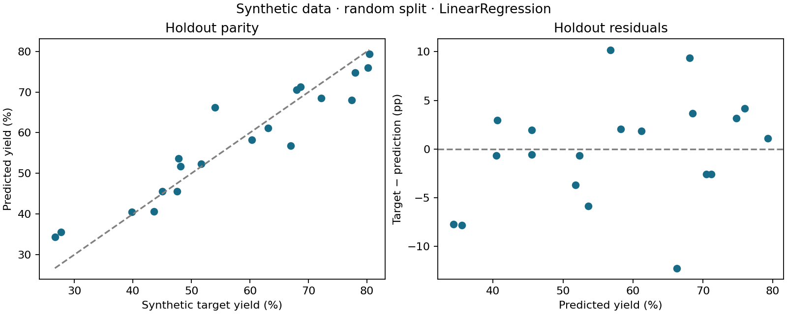

# Reaction Yield Predictor

**A work-in-progress learning project in reproducible machine learning for chemistry.**

I am Ernest Pae, a chemistry undergraduate developing skills in scientific computing and machine learning. This project began as a small linear-regression exercise. It now explores how to evaluate models carefully, compare them with simple baselines, and recognize the limits of a dataset.

> **Scope:** The bundled dataset contains 100 synthetic observations generated by a known linear equation. This is an educational regression workflow, not a validated reaction predictor or a drug-discovery model. The current refactor was developed with AI assistance and is part of my ongoing study.

## What the project demonstrates

- Training-only, five-fold cross-validation to choose among a mean baseline, linear regression, Ridge, and a random forest.
- Preprocessing inside scikit-learn pipelines to avoid leakage between folds.
- A separate holdout evaluation using MAE, RMSE, and R².
- Random and high-temperature holdout strategies to explore interpolation and extrapolation.
- Saved metrics, row-level predictions, residual plots, data hashes, and dependency versions.
- Batch inference with schema validation and flags for extrapolation and out-of-range yields.
- Tests for split integrity, invalid data, holdout-label isolation, and saved-model inference.

## Run locally

Use **Python 3.12**. From the repository root, create and activate a virtual environment:

```bash
python -m venv .venv
```

On Windows PowerShell: `.venv\Scripts\Activate.ps1`. On macOS/Linux: `source .venv/bin/activate`.

```bash
python -m pip install -c constraints.txt -e .
python -m yield_predictor.cli train --output artifacts/random
python -m yield_predictor.cli train --split high_temperature --output artifacts/high_temperature
python -m yield_predictor.cli predict --model artifacts/random/model.joblib --input examples/new_conditions.csv --output artifacts/new_predictions.csv
python -m unittest discover -s tests -v
```

Installation also provides the `yield-predictor` command. `python src/main.py train` remains an alternate entry point. Paths are relative to your working directory; pass `--data` when running elsewhere. Training reads the CSV without regenerating or overwriting it.

Each training command writes `metrics.json`, `predictions.csv`, `diagnostics.png`, and a fitted `model.joblib`. Model files and local artifacts are ignored by git. Load only trusted model files: joblib uses pickle-based deserialization. The saved model remains fitted on the training partition, not refitted on held-out rows.

## Recorded results

Both experiments use seed 42 and an 80/20 split on the original synthetic CSV. Model choice and hyperparameters use training CV MAE, not holdout scores. The candidate search contains nine configurations; the final report compares only its selected model with a training-mean baseline.

| Evaluation | Selected model | Model MAE (pp) | Baseline MAE (pp) | Model RMSE (pp) | Model R² |
| --- | --- | ---: | ---: | ---: | ---: |
| Random holdout | Linear regression | 4.24 | 14.16 | 5.41 | 0.889 |
| High-temperature holdout | Ridge | 4.92 | 12.16 | 5.86 | 0.773 |

These are measured results from this revision, not expected performance on experimental reactions. Linear models are well matched to the synthetic generator. The split comparison is descriptive: the two holdouts differ, and one run per strategy does not isolate a causal effect of distribution shift. MAE is in **percentage points**, and R² can be negative.



See [random-split metrics](reports/random/metrics.json), [temperature-holdout metrics](reports/high_temperature/metrics.json), and [experiment notes](reports/README.md). Fold variability and permutation-shuffle variability are descriptive, not confidence intervals.

## Chemistry context and limitations

The inputs are temperature (°C), time (hours), and concentration (mol/L). There are no molecular structures, reaction identities, catalysts, solvents, or measured laboratory yields. See the [data card](data/README.md) for the exact generating equation and provenance.

Reaction-yield prediction could eventually support synthesis planning, including preparation of candidate compounds. This project currently practices the ML foundations for that direction; it does not predict biological activity or drug efficacy. Useful next work is an appropriately licensed experimental dataset, molecular representations, and group-aware evaluation. Adding a larger model alone would not resolve the missing chemistry.

## Read the code

| File | Purpose |
| --- | --- |
| `src/yield_predictor/data.py` | Input contracts and holdout strategies |
| `src/yield_predictor/modeling.py` | Pipelines and training-only model search |
| `src/yield_predictor/experiment.py` | Evaluation, artifacts, diagnostics, inference |
| `src/yield_predictor/cli.py` | Command-line interface |
| `tests/test_workflow.py` | Data and evaluation regression checks |
| `examples/regenerate_data.py` | Reproduce the original synthetic observations |

## Learning status

The original project and its history are retained. The v0.2 structure, evaluation safeguards, and tests were developed with AI assistance; I am studying the additions and their assumptions. Comments marked as learning notes explain why a choice matters. They do not imply that every technique is already mastered.

The [learning guide](docs/LEARNING_GUIDE.md) provides a code-reading route, exercises, interview questions, and a realistic next-step plan. Current gaps include experimental validation, replicate/group-aware evaluation, uncertainty calibration, and broader seed/dataset sensitivity analysis.

## References

- [scikit-learn: common pitfalls and leakage](https://scikit-learn.org/stable/common_pitfalls.html)
- [scikit-learn: cross-validation](https://scikit-learn.org/stable/modules/cross_validation.html)
- [scikit-learn: permutation importance](https://scikit-learn.org/stable/modules/permutation_importance.html)
